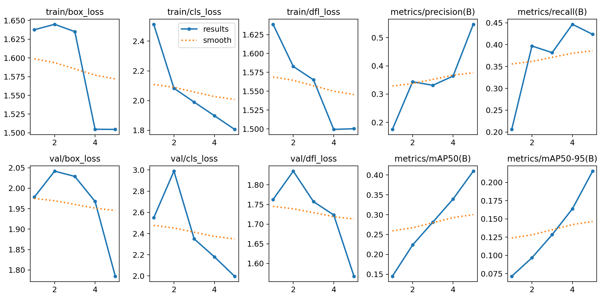
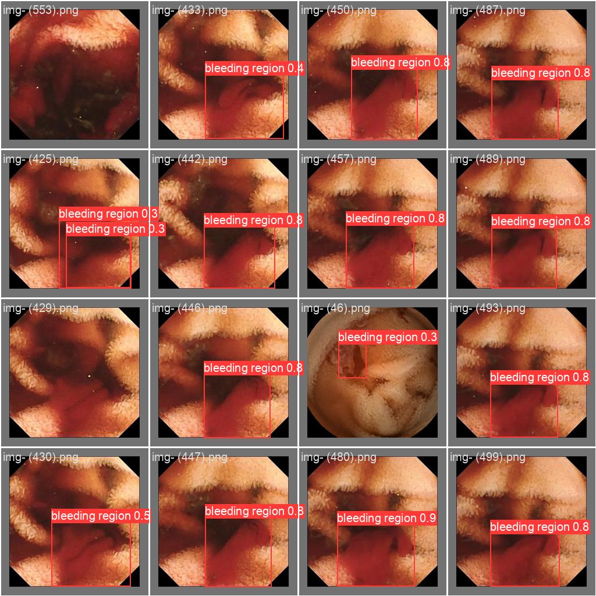

# PLASMA LENS 🩸🅰️🅱️🅾️

**Plasma Lens** is a **Deep Learning Model** that detects and highlights the instances of bleeding in the Gastrointestinal Tract.
                 
The model has been trained with over 1500+ Bleeding & Non - Bleeding photos, with over various categories like Fresh Blood, Hematin Blood, etc from Kvasir & Gastrolab Datasets.

**Accuracy :** **`85.67%(8618823/10060800)`**

**Model :** **`PLASMA LENS`**

**Dataset :** **`Auto-WCBleedGen Challenge Data Sets`**

## OBJECTIVE
The objective of Auto-WCEBleedGen-Challenge is to provide the opportunity for the development, testing, and evaluation of Artificial Intelligence (AI) models to detect and classify the Bleeding and Non-Bleeding frames extracted from Wireless Capsule Endoscopy (WCE) videos and further detect the bleeding region in that frame.

## Okay Cool, How did we build it?

#### Imported dataset from **[Auto-WCBleedGen Challenge Data Sets1](https://zenodo.org/records/10642779)** , **[Auto-WCBleedGen Challenge Data Sets2](https://zenodo.org/records/10156571)** Module.

The dataset for the Auto-WCEBleedGen-Challenge consists of the Training Dataset, Test Dataset 1, and Test Dataset 2.

Training Dataset: It consists of Annotations and Images for both Bleeding and Non-Bleeding frames along with Bounding boxes for the Bleeding frames. The Training Data is divided in 80:20 as the training and validation dataset.

Testing Dataset: Test Dataset 1 contains 49 frames collected randomly from seven different patient data. Test Dataset 2 contains 515 frames collected from twenty-three different patient data.

#### Mixed precision is the use of both 16-bit and 32-bit floating-point types in a model during training to make it **run faster** and use **less memory**.

## Feature Extraction with DenseNet-121

#### DenseNet-121 is a deep convolutional neural network architecture known for its dense connectivity patterns. In feature extraction, pre-trained DenseNet-121 is utilized to extract meaningful features from wireless endoscopy images.

#### Key Features :
Dense connectivity: Each layer is connected to every other layer in a feed-forward fashion, facilitating feature reuse and promoting feature propagation.
Feature maps: DenseNet-121 generates rich feature maps by aggregating features from all preceding layers, enabling effective representation learning.
Benefits:
  - Enhanced feature representation: DenseNet-121 captures intricate patterns and structures in endoscopy images, facilitating better discrimination between bleeding and non-bleeding conditions.
  - Transfer learning: Leveraging pre-trained DenseNet-121 allows for efficient feature extraction without the need for extensive training on large datasets.

## Training with CNN2D

CNN2D (Convolutional Neural Network for 2D data) is employed for the classification task after feature extraction with DenseNet-121. CNN2D is trained on the extracted features to classify wireless endoscopy images into bleeding and non-bleeding categories.
Convolutional layers: CNN2D utilizes convolutional layers to extract spatial features from the feature maps generated by DenseNet-121.
Pooling layers: Pooling layers are employed to downsample the feature maps, reducing spatial dimensions while retaining important features.
Fully connected layers: Fully connected layers are added to the network for classification, enabling the model to learn discriminative representations.
Training Process:
  - Training is performed on the extracted features using a supervised learning approach.
  - Backpropagation and gradient descent are used to optimize the model parameters and minimize the classification loss

## Results

## Breaking down the repo

At first glance, the files in the repo may look intimidating and overwhelming. To avoid that, here is a quick guide :

* `README.md`: Functioning and details of the whole project.
* `PlasmaLens.ipynb`: Google Colab Notebook used to train the model.
* `segmentation.ipynb`: Google Colab Notebook used for Semantic Segmentation.
* `detect/train`: results of YOLO(“You Only Look Once”)

## Created by - 

*  Emandi Srinivas
*  Vishal Saini
*  MD Ashif Jamal
*  Aditya Singh
*  Ishu Malik
*  Yuvraj Choudhary
*  KeeratPreet Singh
*  Rishav Raj
